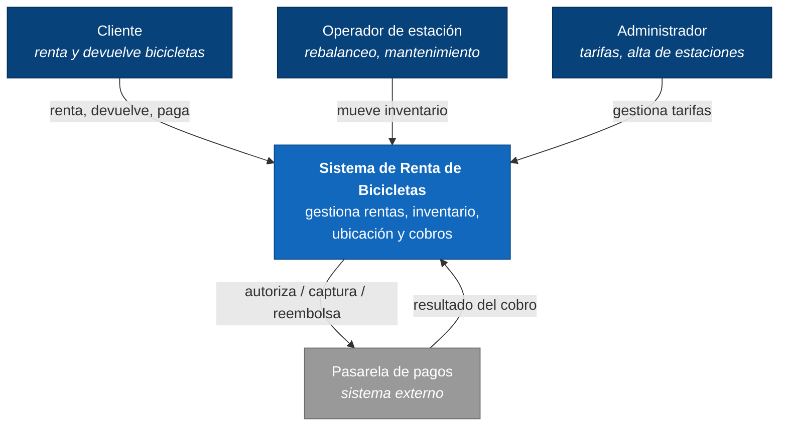
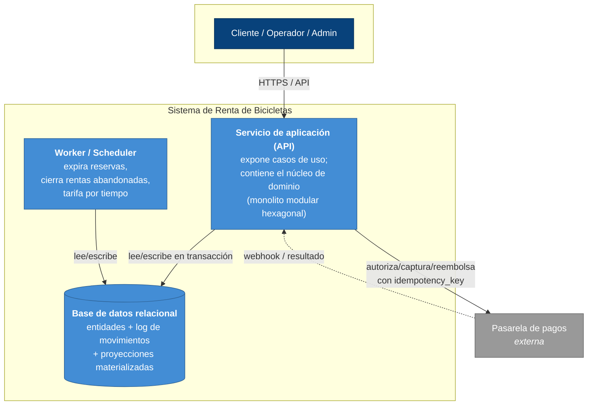
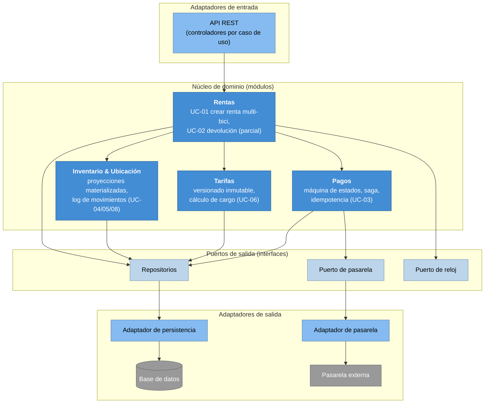

# Arquitectura Técnica — Sistema de Renta de Bicicletas

> **Estado:** versión inicial (v0.1) · **Tipo:** documento de arquitectura
> **Convención de idioma:** narrativa en español; identificadores en inglés (ver [CLAUDE.md](../CLAUDE.md)).
> **Documentos raíz:** [Especificación funcional](especificacion-funcional.md), [Modelo de datos](modelo-de-datos.md), [ADRs](adr/).

---

## 1. Propósito y alcance

Describe **cómo se estructura el sistema** para cumplir la especificación funcional con las decisiones ya tomadas en los ADRs. Usa el modelo [C4](https://c4model.com/) en sus tres primeros niveles (contexto, contenedores, componentes). Se mantiene **agnóstico del stack concreto**: el lenguaje, framework y motor de base de datos se justifican en el [documento de stack](stack.md) y su [ADR-0009](adr/0009-stack-tecnologico.md). Aquí se decide la *forma* (estilo, límites, responsabilidades), no las *herramientas*.

**Fuera de alcance:** detalle de despliegue específico de nube, dimensionamiento, CI/CD, y el código (la rebanada de implementación, si se hace, es posterior).

---

## 2. Drivers arquitectónicos

La arquitectura se optimiza para los requisitos no funcionales que el dominio prioriza (spec §9), en este orden:

1. **Correctitud transaccional (NFR-01) — el driver dominante.** Renta, devolución y movimiento deben preservar las invariantes de inventario y ubicación de forma atómica. La estructura debe mantener esas invariantes en un único límite transaccional, no repartidas.
2. **Concurrencia segura (NFR-02, C-03).** Prevenir doble asignación sin bloqueos largos.
3. **Auditabilidad (NFR-03).** Todo movimiento y cobro, registrado y reconstruible.
4. **Idempotencia (NFR-04, C-06).** Cobros tolerantes a reintentos; consistencia ante fallo parcial con un tercero.
5. **Extensibilidad del modelo de tarifas (NFR-08)** y separación de permisos por actor (NFR-07).

Estos drivers favorecen **cohesión transaccional sobre distribución**: el caso central (renta multi-bici, [UC-01](especificacion-funcional.md)) toca varias entidades bajo una garantía "todo o nada", lo que penaliza fuertemente cualquier frontera de red en medio de esa operación.

---

## 3. Estilo de arquitectura

**Decisión: monolito modular con arquitectura hexagonal (puertos y adaptadores).** Ver [ADR-0008](adr/0008-estilo-de-arquitectura.md).

- **Monolito modular** (no microservicios): el núcleo de negocio se despliega como una sola unidad, con módulos de dominio internos de límites claros (rentas, inventario/ubicación, tarifas, pagos). Razón: la correctitud transaccional (NFR-01) es el driver dominante y el caso central cruza varios módulos en una sola transacción; meter red entre ellos forzaría sagas/2PC donde una transacción local basta. El alcance (un operador, spec §2.2) no justifica el costo operativo de microservicios.
- **Hexagonal** (puertos y adaptadores): el dominio no depende de infraestructura. La pasarela de pagos, la base de datos y el reloj/scheduler entran por **puertos** (interfaces) con **adaptadores** intercambiables. Razón: aísla las reglas de negocio (lo que evalúa el dominio asegurador) de la tecnología (lo diferido al stack), y hace testeable el núcleo sin base de datos ni pasarela reales.

---

## 4. C4 Nivel 1 — Diagrama de contexto

Quién usa el sistema y con qué sistemas externos habla.

---

## 5. C4 Nivel 2 — Diagrama de contenedores

Las unidades desplegables y su comunicación. Stack-agnóstico: "servicio de aplicación" no presupone lenguaje.

**Notas:**
- El **servicio de aplicación** aloja el núcleo de dominio; las invariantes transaccionales (NFR-01) viven aquí, contra una única base de datos → una transacción local cubre el caso central.
- El **worker/scheduler** materializa el Actor Sistema de la spec (§3): expira reservas ([ADR-0006](adr/0006-estrategia-de-concurrencia.md)) y cierra rentas abandonadas (C-09).
- La **pasarela** es el único sistema externo; el cruce con ella es donde aplica la saga ([ADR-0007](adr/0007-modelo-de-pago-e-idempotencia.md)), no una transacción de BD.

---

## 6. C4 Nivel 3 — Componentes del servicio de aplicación

Estructura interna del monolito modular, en estilo hexagonal: adaptadores de entrada → módulos de dominio (con sus puertos) → adaptadores de salida.

**Responsabilidades y por qué este corte:**

| Módulo | Responsabilidad | Invariantes que protege |
|---|---|---|
| **Rentas** | Orquesta el caso central (UC-01) y la devolución (UC-02). Es el dueño de la transacción de renta. | Atomicidad RN-05; estado de renta derivado ([ADR-0004](adr/0004-estado-de-renta-derivado-de-itemrenta.md)). |
| **Inventario & Ubicación** | Mantiene proyecciones (`BICYCLE_LOCATION`, `available_inventory`) y el log `MOVEMENT`. | RN-01, RN-16/17/18 ([ADR-0003](adr/0003-ubicacion-e-inventario-como-proyecciones-materializadas.md)). |
| **Tarifas** | Versionado inmutable y cálculo de cargo. | RN-08, congelado de tarifa ([ADR-0005](adr/0005-tarifa-versionada-inmutable-con-snapshot.md)). |
| **Pagos** | Máquina de estados del cobro, idempotencia y saga de compensación. | RN-19, RN-20, C-06 ([ADR-0007](adr/0007-modelo-de-pago-e-idempotencia.md)). |

El módulo **Rentas** coordina a los demás **dentro de una sola transacción** para el caso central; solo el cruce con **Pagos→pasarela** sale del límite transaccional y se gobierna por saga.

---

## 7. Cómo las decisiones (ADRs) se reflejan en la estructura

| Decisión (ADR) | Dónde vive en la arquitectura |
|---|---|
| [0002](adr/0002-uuid-v7-como-estrategia-de-llaves.md) UUIDv7 | Identidad generada en el dominio antes de persistir/llamar a la pasarela (habilita idempotencia). |
| [0003](adr/0003-ubicacion-e-inventario-como-proyecciones-materializadas.md) proyecciones + log | Módulo Inventario & Ubicación; actualización en la misma transacción que el cambio de estado. |
| [0004](adr/0004-estado-de-renta-derivado-de-itemrenta.md) estado de renta derivado | Módulo Rentas recalcula el estado en la transacción de devolución. |
| [0005](adr/0005-tarifa-versionada-inmutable-con-snapshot.md) tarifa congelada | Módulo Tarifas; el snapshot lo escribe Rentas al crear la renta. |
| [0006](adr/0006-estrategia-de-concurrencia.md) optimista + reserva | Reserva creada por Rentas; expiración por el Worker/Scheduler; `version` en la persistencia. |
| [0007](adr/0007-modelo-de-pago-e-idempotencia.md) pago/saga | Módulo Pagos a través del puerto de pasarela; compensación orquestada por Rentas. |
| [0008](adr/0008-estilo-de-arquitectura.md) monolito modular hexagonal | Toda la estructura de §3 y §6. |

---

## 8. Aspectos transversales

- **Límite transaccional:** la operación de renta (UC-01) y la de devolución (UC-02) se ejecutan en **una transacción de base de datos** que cubre estado de bicicleta, ítems, proyecciones de inventario/ubicación y log de movimientos. El único paso fuera de la transacción es la llamada a la pasarela.
- **Frontera de la saga:** entre "autorizar cobro" y "confirmar renta" ([ADR-0007](adr/0007-modelo-de-pago-e-idempotencia.md)). Si falla tras autorizar, el módulo Pagos ejecuta la compensación (anular/reembolsar) y la renta queda `fallida`.
- **Concurrencia:** reserva con expiración para la fase interactiva + control optimista (`version`) al confirmar ([ADR-0006](adr/0006-estrategia-de-concurrencia.md)). El Worker libera reservas vencidas.
- **Auditabilidad:** `MOVEMENT` (append-only) y los timestamps de transición de `PAYMENT` dan la traza reconstruible (NFR-03).
- **Seguridad/permisos:** los adaptadores de entrada aplican autorización por actor (cliente/operador/admin, NFR-07) antes de invocar el dominio; los datos de tarjeta nunca entran al sistema (S-03).

---

## 9. Vista de despliegue (ligera, agnóstica de stack)

Para el alcance actual (un operador, disponibilidad en horario de servicio, NFR-05) basta un despliegue simple: una instancia del servicio de aplicación (escalable horizontalmente si hiciera falta, al ser sin estado salvo la BD), el worker/scheduler como proceso aparte u oferta programada, y una base de datos relacional gestionada. No se requiere multi-región ni alta disponibilidad compleja en esta versión. El detalle concreto (nube, contenedores, CI/CD) se difiere al stack y a la pieza de shipping.

---

## 10. Trazabilidad NFR → mecanismo arquitectónico

| NFR (spec §9) | Mecanismo en la arquitectura |
|---|---|
| NFR-01 integridad transaccional | Monolito modular: invariantes en una transacción local (§3, §8) |
| NFR-02 concurrencia | Reserva + optimista; Worker de expiración (§8, ADR-0006) |
| NFR-03 auditabilidad | Log `MOVEMENT` append-only + timestamps de pago (§8, ADR-0003) |
| NFR-04 idempotencia | `idempotency_key` desde UUIDv7; saga en módulo Pagos (§8, ADR-0002/0007) |
| NFR-05 disponibilidad | Despliegue simple sin estado en el servicio (§9) |
| NFR-06 rendimiento (UC-05) | Proyección `available_inventory` O(1) (ADR-0003) |
| NFR-07 seguridad/permisos | Autorización por actor en adaptadores de entrada (§8) |
| NFR-08 extensibilidad de tarifas | Módulo Tarifas aislado por puerto; versionado (ADR-0005) |
