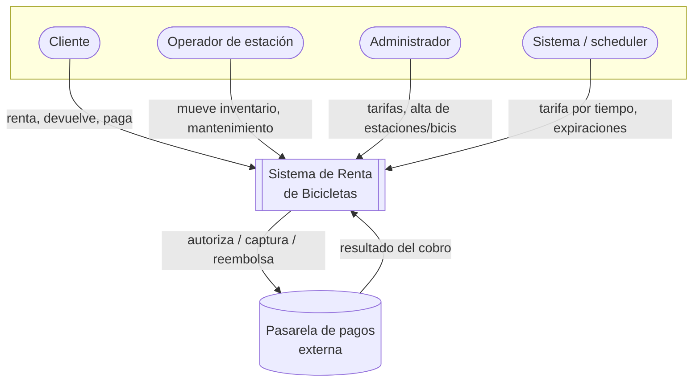
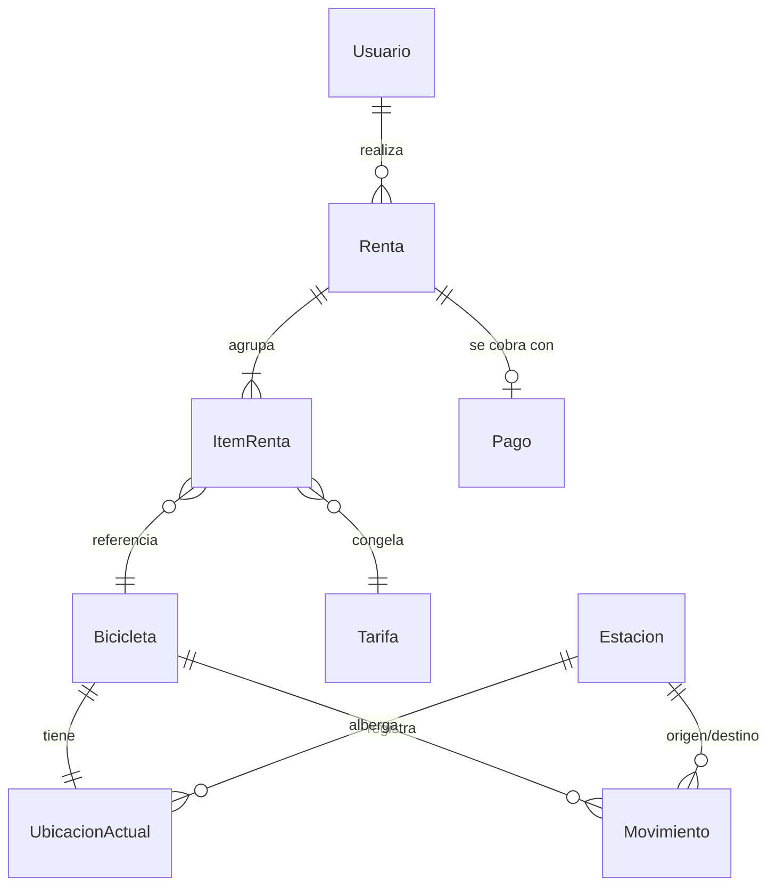
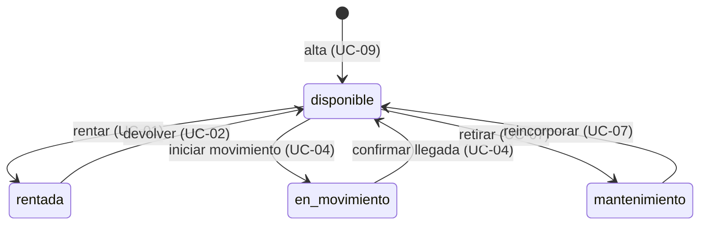
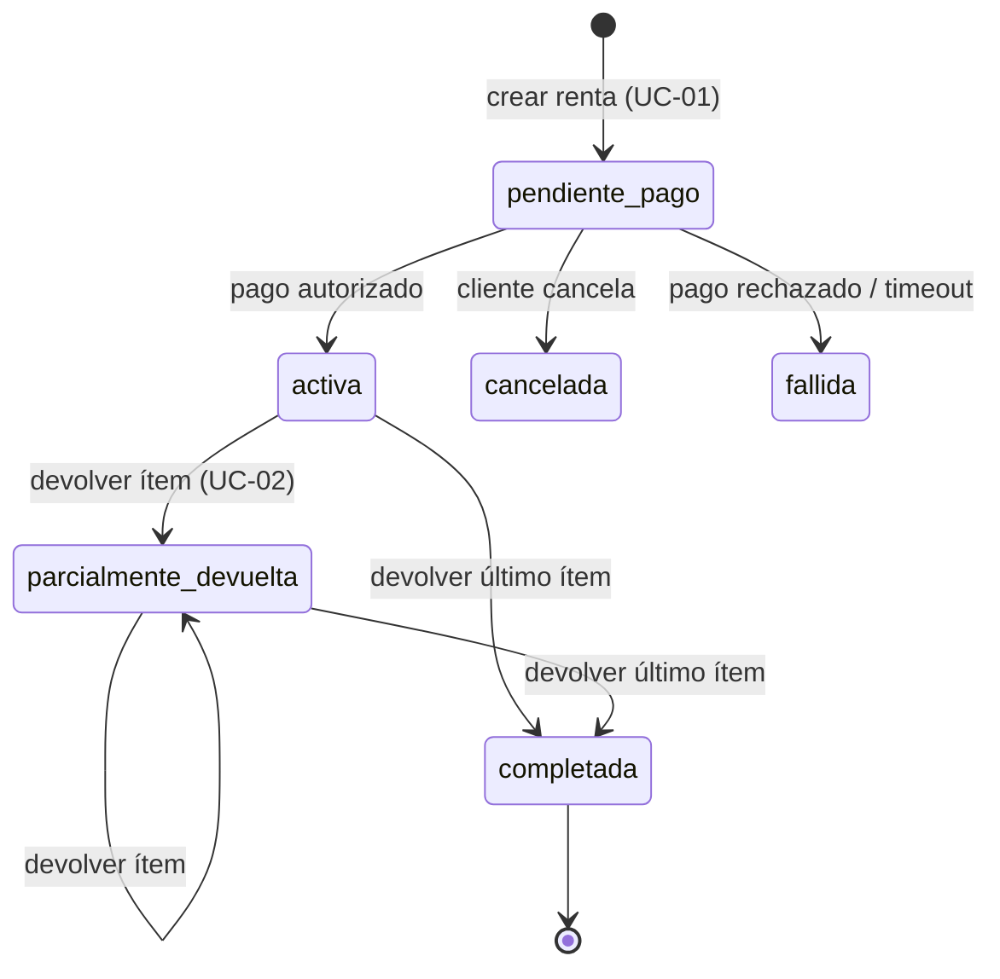
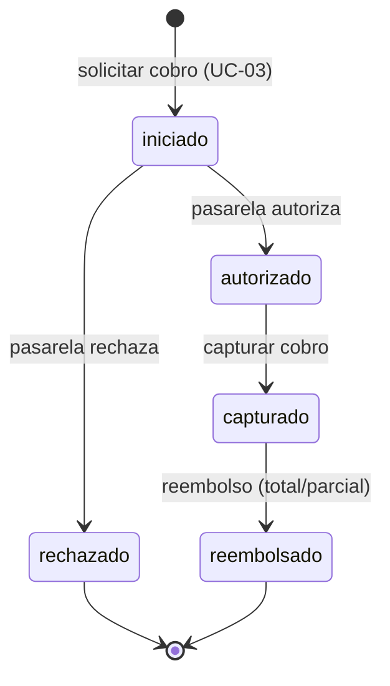

# Especificación Funcional — Sistema de Renta de Bicicletas

> **Estado:** versión inicial (v0.1) · **Tipo:** documento de diseño funcional
> **Convención de idioma:** dominio y narrativa en español; identificadores de dominio en inglés cuando aplique (ver [CLAUDE.md](../CLAUDE.md)).

---

## 1. Propósito y alcance

### 1.1 Objetivo del documento

Definir **qué** debe hacer la plataforma de renta de bicicletas: actores, casos de uso, reglas de negocio, estados y restricciones. Es la **raíz** del diseño — el modelo de datos, los ADRs y la arquitectura se justifican contra este documento.

Este documento describe el **qué**, no el **cómo**. No contiene decisiones de stack, modelo físico de datos ni diseño de APIs; esos viven en sus documentos respectivos (ver §1.3).

### 1.2 Alcance

**Cubre (esta versión):**

- Renta de una o varias bicicletas en una sola transacción.
- Devolución (total y parcial) de bicicletas.
- Control de inventario por estación.
- Rastreo de la ubicación actual de cada bicicleta.
- Movimiento (rebalanceo) de bicicletas entre estaciones.
- Cobro de la renta a través de una pasarela de pagos externa.
- Gestión de tarifas con vigencia temporal.

**No cubre (esta versión):**

- Aplicación móvil o frontend específico (se describe comportamiento, no interfaz).
- Programas de fidelización, cupones o precios dinámicos por demanda.
- Mantenimiento predictivo o telemetría IoT de las bicicletas.
- Multi-tenant / multi-operador. Se asume un único operador.
- Alta disponibilidad multi-región (ver §9).

### 1.3 Audiencia y documentos relacionados

Dirigido a quien diseña y evalúa la solución técnica. Documentos hermanos (piezas posteriores del entregable):

| Documento | Contenido | Estado |
|---|---|---|
| Modelo de datos | Detalle de entidades, atributos, relaciones, integridad | Pendiente |
| ADRs (`docs/adr/`) | Decisiones de arquitectura con trade-offs | Pendiente (alimentados por §8) |
| Arquitectura técnica | Diagramas C4, componentes, despliegue | Pendiente |
| Stack tecnológico | Lenguaje, framework, persistencia, justificación | Pendiente |

---

## 2. Contexto de negocio

### 2.1 Descripción del dominio

Un operador gestiona una red de **estaciones** físicas distribuidas en una ciudad. Cada estación alberga **bicicletas** disponibles para renta y tiene una **capacidad** máxima. Un **cliente** toma una o varias bicicletas de una estación, las usa y las devuelve en una estación (la misma u otra). El uso genera un **cobro** según una **tarifa** vigente. El operador **rebalancea** el inventario moviendo bicicletas entre estaciones para responder a la demanda.

El sistema debe responder en todo momento a tres preguntas con exactitud:

1. **¿Qué hay disponible y dónde?** — inventario por estación.
2. **¿Dónde está cada bicicleta ahora?** — ubicación actual.
3. **¿Quién tiene qué rentado y cuánto debe?** — rentas y cobros.

### 2.2 Supuestos y restricciones de negocio

- **S-01:** Una bicicleta pertenece como máximo a una estación a la vez (o está en tránsito, o en poder de un cliente). Nunca cuenta en dos lugares.
- **S-02:** El operador es único; no hay competencia entre operadores por el mismo inventario.
- **S-03:** Los datos sensibles de pago (número de tarjeta) los maneja la pasarela externa; el sistema **no** los almacena (ver §9, seguridad).
- **S-04:** Una renta siempre se inicia desde una estación concreta (no hay renta "en la calle").
- **S-05:** La identidad del cliente está establecida antes de rentar (registro fuera del alcance detallado; ver UC-10).

---

## 3. Actores del sistema

| Actor | Tipo | Qué hace | Por qué existe (justificación) |
|---|---|---|---|
| **Cliente** (`Customer`) | Humano, primario | Renta y devuelve bicicletas; paga | Dispara el caso de uso central. Mapea a `Usuario`. |
| **Operador de estación** (`Station Operator`) | Humano, primario | Registra movimientos de inventario entre estaciones; marca bicicletas en mantenimiento; valida devoluciones | El cliente **no** mueve inventario: el rebalanceo es una operación de staff. Justifica `Movimiento` y las transiciones a `mantenimiento`. |
| **Administrador** (`Admin`) | Humano, primario | Gestiona `Tarifa`; da de alta estaciones y bicicletas; consulta reportes | Separar admin de operador establece una **frontera de autorización**. La gestión de tarifas tiene impacto financiero y no debe estar al alcance del operador. |
| **Pasarela de pagos** (`Payment Gateway`) | Sistema externo, secundario | Autoriza, captura y reembolsa cobros; notifica el resultado | La entidad `Pago` implica un tercero. Modelarlo como actor externo obliga a pensar latencia, fallos y asincronía del cobro. |
| **Sistema / scheduler** | Sistema interno, secundario | Dispara cálculo de tarifa por tiempo; expira rentas abandonadas; libera reservas vencidas | Algunas reglas (tarifa por tiempo, timeouts) no las dispara un humano. Hacerlo explícito evita reglas "huérfanas". |

### Diagrama de contexto

---

## 4. Modelo conceptual (resumen)

El modelo conceptual está definido por nueve entidades. Este documento las referencia narrativamente; el detalle (atributos, tipos, integridad) vive en el documento de modelo de datos.

| Entidad | Rol en el dominio |
|---|---|
| `Usuario` | Cliente que renta bicicletas. |
| `Estacion` | Punto físico con capacidad e inventario de bicicletas. |
| `Bicicleta` | Unidad rentable; tiene un estado y una ubicación actual. |
| `Renta` | Cabecera de una transacción de renta; agrupa 1..N ítems. |
| `ItemRenta` | Línea de una renta; referencia exactamente una `Bicicleta`. |
| `UbicacionActual` | Ubicación vigente de una bicicleta (ver tensión de diseño C-01). |
| `Movimiento` | Registro auditable del traslado de una bicicleta entre estaciones. |
| `Tarifa` | Esquema de precio con vigencia temporal. |
| `Pago` | Cobro asociado a una renta, gestionado vía pasarela externa. |

> El diagrama expresa cardinalidades conceptuales, no el modelo físico. Las decisiones sobre cómo materializar `UbicacionActual` se tratan en §8 (C-01).

---

## 5. Casos de uso

### 5.1 Inventario priorizado

**MUST — núcleo del dominio:**

| ID | Caso de uso | Actor primario |
|---|---|---|
| **UC-01** ⭐ | Crear renta con múltiples bicicletas | Cliente |
| **UC-02** | Devolver bicicleta(s) — total o parcial | Cliente |
| **UC-03** | Procesar pago de una renta | Cliente / Pasarela |
| **UC-04** | Registrar movimiento de inventario entre estaciones | Operador |
| **UC-05** | Consultar disponibilidad por estación | Cliente |

**SHOULD:**

| ID | Caso de uso | Actor primario |
|---|---|---|
| UC-06 | Gestionar tarifas (alta / edición / vigencia) | Admin |
| UC-07 | Marcar bicicleta en mantenimiento / reincorporar | Operador |
| UC-08 | Consultar ubicación actual de una bicicleta | Operador / Admin |
| UC-09 | Alta de estación / bicicleta | Admin |

**COULD — mencionados, no detallados:**

| ID | Caso de uso |
|---|---|
| UC-10 | Registro / identificación de cliente |
| UC-11 | Historial de rentas del cliente |
| UC-12 | Reportes de utilización por estación |

### 5.2 Caso de uso central — UC-01 Crear renta con múltiples bicicletas ⭐

Es el caso que mejor demuestra criterio de arquitectura por su **atomicidad transaccional**: varias bicicletas, varias filas de inventario, varios estados y un cobro externo, todo bajo un único resultado *todo-o-nada*.

- **Actor primario:** Cliente. **Secundarios:** Pasarela de pagos, Sistema.
- **Precondiciones:** cliente identificado (S-05); estación de origen seleccionada; existe al menos una `Tarifa` vigente.
- **Disparador:** el cliente confirma una selección de N bicicletas en una estación.

**Flujo principal:**

1. El cliente selecciona estación de origen y N bicicletas.
2. El sistema valida que cada bicicleta esté `disponible` y físicamente en esa estación (consistencia de `UbicacionActual`, RN-02, RN-18).
3. El sistema **reserva** las N bicicletas (estado intermedio; ver C-03).
4. El sistema calcula el precio estimado por `ItemRenta` según la `Tarifa` vigente (RN-07).
5. El sistema crea la `Renta` (cabecera) con N `ItemRenta`, congelando la tarifa en cada ítem (RN-08).
6. El sistema solicita autorización de cobro a la pasarela (`Pago`, RN-19).
7. La pasarela autoriza → el sistema confirma: las bicicletas pasan a `rentada`, decrementa el inventario de la estación, la `Renta` queda `activa`.
8. El sistema confirma la renta al cliente.

**Flujos alternativos y excepciones:**

- **2a.** Inventario insuficiente al inicio → no se crea la renta; se pueden sugerir estaciones cercanas (UC-12, COULD).
- **3a.** Una bicicleta deja de estar disponible entre la selección y la confirmación (concurrencia) → ver **C-03**. Opciones: abortar toda la renta (atomicidad estricta) o continuar con las disponibles previa confirmación del cliente. **Decisión de ADR.**
- **6a.** La pasarela rechaza o expira → se liberan todas las reservas; la `Renta` queda `fallida`/`cancelada`; el inventario no cambia (atomicidad total, RN-05).
- **7a.** Fallo del sistema entre cobro autorizado y confirmación de la renta → requiere idempotencia y compensación (reverso del cobro). Ver **C-06**.

**Postcondiciones (éxito):** N bicicletas en `rentada`; inventario de origen decrementado en N; `Renta` `activa`; `Pago` autorizado; `UbicacionActual` de cada bicicleta = "en poder del cliente / fuera de estación".

> **Invariante central:** *la renta es atómica — o se rentan todas las bicicletas solicitadas y se cobra, o no se renta ninguna y no se cobra* (salvo que C-03 decida la degradación con confirmación explícita).

### 5.3 Casos de uso detallados (núcleo)

#### UC-02 Devolver bicicleta(s)

- **Flujo principal:** el cliente devuelve una o más bicicletas en una estación destino; el sistema valida capacidad (RN-15); cada bicicleta pasa a `disponible`; incrementa el inventario destino; actualiza `UbicacionActual`; cierra el `ItemRenta`; recalcula el cargo real por tiempo (RN-10).
- **Tensiones (ver §8):**
  - Devolución en estación distinta a la de origen (**C-05**, RN-13).
  - **Devolución parcial:** el cliente devuelve 2 de 3 bicicletas → la `Renta` queda `parcialmente_devuelta` y no se cierra hasta el último ítem (**C-04**, RN-14).
  - Estación destino sin capacidad (**C-07**, RN-15).

#### UC-03 Procesar pago

- **Flujo:** cálculo del monto → autorización → captura → registro del `Pago`. Soporta reembolso (parcial o total) ligado a la devolución (RN-10, C-04).
- **Garantías:** idempotencia ante reintentos (RN-20); toda `Renta` activa tiene un `Pago` autorizado (RN-19).

#### UC-04 Registrar movimiento de inventario entre estaciones

- **Actor:** Operador.
- **Flujo:** selecciona bicicletas en la estación A → crea `Movimiento` (origen, destino, estado `en_transito`) → las bicicletas pasan a `en_movimiento` y se descuentan del inventario de A → al confirmar la llegada, pasan a `disponible` y se incrementa el inventario de B; se actualiza `UbicacionActual`.
- **Invariante:** durante `en_movimiento`, la bicicleta **no está disponible para renta ni cuenta en el inventario de ninguna estación** (RN-01) → evita doble conteo. Relación 1:1 entre transición de estación y `Movimiento` (RN-17).

#### UC-05 Consultar disponibilidad por estación

- **Flujo:** dado un identificador o ubicación de estación, devolver el número de bicicletas `disponible` y la capacidad restante. Es la consulta de lectura más frecuente (ver §9, rendimiento).

#### UC-06 Gestionar tarifas

- **Actor:** Admin. CRUD de `Tarifa` con **vigencia temporal**. La tarifa aplicada a una renta es la vigente al momento de crearla, y queda **congelada** en el `ItemRenta` aunque la `Tarifa` cambie después (RN-07, RN-08, C-08).

---

## 6. Reglas de negocio

### Inventario y disponibilidad

- **RN-01:** El inventario de una estación = número de bicicletas en estado `disponible` físicamente presentes. Una bicicleta `rentada`, `en_movimiento` o `mantenimiento` **no** cuenta en ningún inventario.
- **RN-02:** No se puede rentar una bicicleta cuyo estado no sea `disponible` en la estación de origen.
- **RN-03:** Cada estación tiene una capacidad máxima; ninguna devolución o movimiento puede excederla.

### Renta multi-bicicleta (atomicidad)

- **RN-04:** Una `Renta` agrupa 1..N `ItemRenta`; cada `ItemRenta` referencia exactamente una `Bicicleta`.
- **RN-05:** La creación de la renta es atómica: éxito total (todas las bicicletas + cobro) o nulo (ninguna + sin cobro). Sujeta a la decisión de C-03.
- **RN-06:** Una misma bicicleta no puede estar en dos `ItemRenta` activos simultáneamente.

### Tarifa y precio

- **RN-07:** El precio de un `ItemRenta` se calcula con la `Tarifa` vigente al momento de crear la renta.
- **RN-08:** La tarifa aplicada queda **fija (congelada)** en el `ItemRenta` aunque la `Tarifa` cambie después.
- **RN-09:** El cargo puede tener un componente fijo más un componente por tiempo (define la unidad: por minuto / hora / día).
- **RN-10:** El monto final puede diferir del estimado al confirmarse el tiempo real de uso en la devolución.

### Estados (detalle en §7)

- **RN-11:** Una bicicleta está en exactamente uno de: `disponible`, `rentada`, `en_movimiento`, `mantenimiento`.
- **RN-12:** Solo son válidas las transiciones definidas en la máquina de estados (§7); cualquier otra es un error de dominio.

### Devolución

- **RN-13:** La devolución puede realizarse en una estación distinta a la de origen (ver decisión C-05). Si se permite, puede aplicar cargo o descuento por reubicación.
- **RN-14:** Se admite la devolución parcial de una renta multi-bicicleta; la `Renta` no se cierra hasta devolver el último ítem.
- **RN-15:** Solo se puede devolver en una estación con capacidad disponible.

### Consistencia ubicación / movimiento

- **RN-16:** La `UbicacionActual` de una bicicleta debe ser consistente con su estado y con el último `Movimiento` confirmado.
- **RN-17:** Todo cambio de estación de una bicicleta debe quedar registrado como un `Movimiento` (auditoría); `UbicacionActual` refleja el resultado del último movimiento confirmado.
- **RN-18:** No puede existir una bicicleta `disponible` cuya `UbicacionActual` no corresponda a una estación.

### Pago

- **RN-19:** Toda `Renta` activa debe tener un `Pago` autorizado.
- **RN-20:** Las operaciones de cobro deben ser idempotentes: un reintento no duplica el cargo.

---

## 7. Máquinas de estado

### 7.1 Estados de la bicicleta

**Transiciones ilegales** (error de dominio, RN-12): `rentada → en_movimiento`, `rentada → mantenimiento`, `en_movimiento → rentada`, `mantenimiento → rentada`. Una bicicleta solo entra a movimiento o mantenimiento desde `disponible`.

### 7.2 Estados de la renta

> `parcialmente_devuelta` y `completada` son **estados derivados** del estado de los `ItemRenta` (insumo de C-04): la renta se considera completada cuando todos sus ítems están cerrados.

### 7.3 Estados del pago

---

## 8. Casos borde y decisiones abiertas (insumo para ADRs)

Esta es la sección que sostiene la defensa del diseño. Cada fila es un **backlog de ADR**: una tensión real del modelo, sus opciones y una recomendación tentativa con su porqué.

| ID | Situación | Opciones | Recomendación tentativa | → ADR |
|---|---|---|---|---|
| **C-01** | `UbicacionActual`: ¿estado derivado o tabla materializada? | (a) Derivar del último `Movimiento`/`ItemRenta` (fuente única, sin desincronía, costo de cálculo). (b) Materializar en tabla (lectura rápida, riesgo de inconsistencia). | **(b) Tabla materializada**, actualizada dentro de la **misma transacción** que el movimiento/renta, con el log de `Movimiento` como fuente auditable y reconstruible. Combina lectura rápida con verdad reconstruible. | Sí — *estrategia de ubicación actual* |
| **C-02** | Estación se queda sin inventario a mitad de la transacción multi-bici. | (a) Abortar toda la renta. (b) Degradar a las bicicletas disponibles. | **(a) Atomicidad estricta** por defecto (RN-05); degradación solo con confirmación explícita del cliente. | Sí |
| **C-03** | Concurrencia: dos clientes rentan la última bicicleta. | (a) Bloqueo pesimista (lock de fila). (b) Optimista (versión + reintento). (c) Reserva con expiración. | **(c) Reserva con expiración** para la sesión interactiva, respaldada por control optimista al confirmar. Evita locks largos durante la decisión del cliente. | Sí — *estrategia de concurrencia* |
| **C-04** | Devolución parcial de renta multi-bici. | (a) Liquidar por ítem. (b) Preautorizar el total y ajustar al cierre. | **(b) Preautorizar el total** al rentar y **capturar/ajustar por ítem** en cada devolución; la renta cierra con el último ítem (RN-14). | Sí |
| **C-05** | Devolución en estación distinta al origen. | (a) Permitida sin cargo. (b) Permitida con cargo por reubicación. (c) No permitida. | **(a/b) Permitida**; cargo por reubicación configurable vía `Tarifa`. Genera necesidad de rebalanceo (UC-04). | Sí (menor) |
| **C-06** | Fallo entre cobro autorizado y confirmación de la renta. | (a) Reintento idempotente. (b) Saga con compensación (reverso del cobro). | **(b) Patrón saga** con paso de compensación + claves de idempotencia (RN-20) en las llamadas a la pasarela. | Sí — *patrón transaccional / consistencia* |
| **C-07** | Estación destino llena en devolución o movimiento. | (a) Rechazar. (b) Redirigir a estación cercana. (c) Sobrecupo temporal. | **(a) Rechazar** por defecto (RN-03), con sugerencia de estación cercana (b) como mejora. | Sí (menor) |
| **C-08** | Cambio de tarifa con rentas activas. | (a) Recalcular con la nueva. (b) Congelar la vigente al rentar. | **(b) Congelar** (RN-08): predecible para el cliente y auditable. | Sí (menor) |
| **C-09** | Renta abandonada / no devuelta (timeout). | (a) Cierre automático con cargo máximo. (b) Escalar a operador. | **(a) Cierre automático** disparado por el scheduler con un cargo tope definido por política. | Sí (menor) |

---

## 9. Requisitos no funcionales

Realistas para el alcance; sin SLAs inflados. La NFR estrella de este dominio es la **correctitud transaccional**, no el rendimiento.

| ID | Requisito | Detalle |
|---|---|---|
| **NFR-01** Integridad transaccional ⭐ | Renta, devolución y movimiento son transaccionales y preservan las invariantes de inventario y ubicación (RN-01, RN-16). | Es la propiedad central del caso. |
| **NFR-02** Concurrencia | El sistema previene la doble asignación de una misma bicicleta bajo acceso concurrente (C-03, RN-06). | — |
| **NFR-03** Auditabilidad | Todo movimiento de bicicleta y toda operación de pago quedan registrados y son reconstruibles. | Soportado por `Movimiento` y `Pago`. |
| **NFR-04** Idempotencia | Las operaciones que disparan cobros externos toleran reintentos sin duplicar efectos (RN-20, C-06). | — |
| **NFR-05** Disponibilidad | Objetivo modesto: operación en horario de servicio; sin alta disponibilidad multi-región en esta versión. | Honesto con el alcance. |
| **NFR-06** Rendimiento | Consulta de disponibilidad por estación (UC-05) con tiempo de respuesta interactivo (objetivo orientativo < 1 s para un catálogo de tamaño moderado). | Sin prometer cifras sin base. |
| **NFR-07** Seguridad | Separación de permisos por actor (cliente / operador / admin); los datos de pago los maneja la pasarela (el sistema no almacena PAN, S-03). | — |
| **NFR-08** Extensibilidad | El modelo de tarifas admite nuevos esquemas de precio sin rediseño (RN-09). | — |

---

## 10. Glosario

| Término | Definición |
|---|---|
| **Estación** | Punto físico con capacidad e inventario de bicicletas. |
| **Bicicleta** | Unidad rentable con un estado y una ubicación actual. |
| **Renta** | Transacción que agrupa la toma de 1..N bicicletas por un cliente. |
| **ItemRenta** | Línea de una renta asociada a una sola bicicleta y a una tarifa congelada. |
| **Movimiento** | Registro auditable del traslado de una bicicleta entre estaciones. |
| **Ubicación actual** | Estación (o estado fuera de estación) donde se encuentra una bicicleta ahora. |
| **Tarifa** | Esquema de precio con vigencia temporal. |
| **Tarifa vigente / congelada** | La tarifa activa al momento de rentar; queda fija en el `ItemRenta`. |
| **Pago** | Cobro asociado a una renta, gestionado por la pasarela externa. |
| **Inventario** | Número de bicicletas `disponible` físicamente presentes en una estación. |
| **Disponibilidad** | Condición de una bicicleta lista para ser rentada. |
| **Capacidad de estación** | Número máximo de bicicletas que una estación puede albergar. |
| **Rebalanceo** | Movimiento de bicicletas entre estaciones para ajustar la oferta a la demanda. |
| **Reserva** | Bloqueo temporal de una bicicleta durante la creación de una renta. |
| **Devolución parcial** | Devolución de un subconjunto de las bicicletas de una renta multi-bici. |
| **Atomicidad de la renta** | Propiedad de "todo o nada" en la creación de una renta multi-bici. |

---

## 11. Trazabilidad

Matriz que conecta cada caso de uso con las reglas que lo gobiernan, las entidades que toca y los casos borde que abre. Sirve para verificar que **no hay reglas ni entidades huérfanas**.

| Caso de uso | Reglas de negocio | Entidades | Casos borde |
|---|---|---|---|
| **UC-01** Crear renta multi-bici | RN-02, RN-04, RN-05, RN-06, RN-07, RN-08, RN-19 | `Usuario`, `Renta`, `ItemRenta`, `Bicicleta`, `Tarifa`, `Pago`, `UbicacionActual` | C-02, C-03, C-06 |
| **UC-02** Devolver bicicleta(s) | RN-01, RN-10, RN-13, RN-14, RN-15, RN-16 | `Renta`, `ItemRenta`, `Bicicleta`, `Estacion`, `UbicacionActual` | C-04, C-05, C-07 |
| **UC-03** Procesar pago | RN-19, RN-20, RN-10 | `Pago`, `Renta`, `ItemRenta` | C-06 |
| **UC-04** Movimiento entre estaciones | RN-01, RN-03, RN-16, RN-17 | `Movimiento`, `Bicicleta`, `Estacion`, `UbicacionActual` | C-07 |
| **UC-05** Consultar disponibilidad | RN-01 | `Estacion`, `Bicicleta` | — |
| **UC-06** Gestionar tarifas | RN-07, RN-08, RN-09 | `Tarifa` | C-08 |
| **UC-07** Mantenimiento de bicicleta | RN-11, RN-12 | `Bicicleta` | — |
| **UC-08** Consultar ubicación | RN-16, RN-18 | `Bicicleta`, `UbicacionActual` | C-01 |
| **UC-09** Alta estación / bicicleta | RN-03, RN-18 | `Estacion`, `Bicicleta` | — |
| Scheduler (transversal) | RN-09 | `Renta`, `Pago` | C-09 |

**Cobertura de entidades:** las nueve entidades del modelo conceptual aparecen en al menos un caso de uso. **Cobertura de reglas:** RN-01..RN-20 están referenciadas por al menos un caso de uso. **Cobertura de casos borde:** C-01..C-09 están enlazados a un caso de uso o regla.
