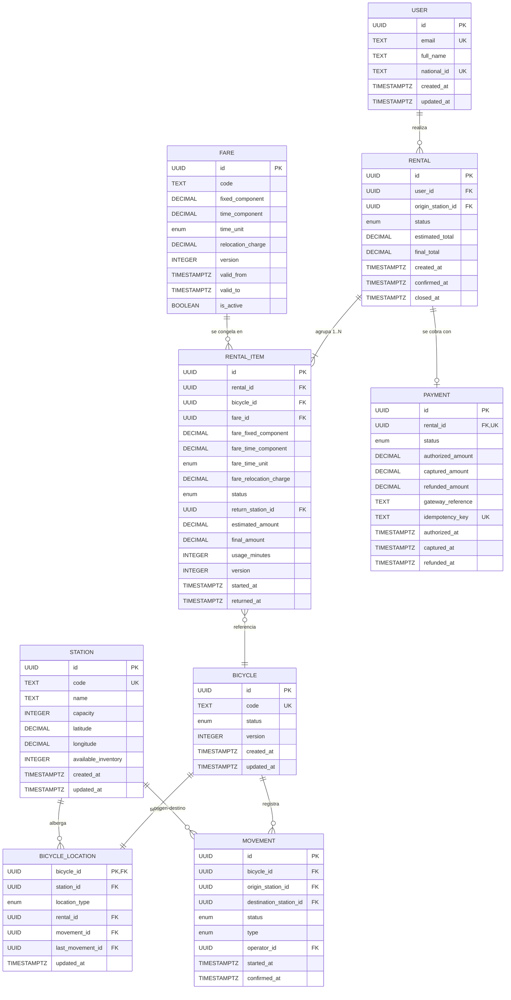

# Modelo de Datos — Sistema de Renta de Bicicletas

> **Estado:** versión inicial (v0.1) · **Tipo:** modelo lógico de datos
> **Nivel:** modelo lógico, independiente del motor de base de datos. Implementable en cualquier RDBMS relacional.
> **Convención de idioma:** narrativa en español; identificadores de tablas/columnas en inglés (ver [CLAUDE.md](../CLAUDE.md)).
> **Documento raíz:** [Especificación funcional](especificacion-funcional.md). Toda regla `RN-xx`, caso de uso `UC-xx` y caso borde `C-xx` referenciados viven allí.

---

## 1. Propósito y alcance

### 1.1 Qué cubre

Aterriza las nueve entidades del modelo conceptual de la spec a un **modelo lógico de datos**: tablas, atributos, tipos lógicos, llaves, relaciones y restricciones de integridad. El foco está en **resolver las cuatro tensiones de fondo** que la spec dejó abiertas (C-01 ubicación, C-04 devolución parcial, RN-08 tarifa congelada, RN-01 inventario), porque ahí es donde el modelo de datos toma decisiones con consecuencias.

### 1.2 Qué NO cubre

- Motor de base de datos concreto (PostgreSQL, MySQL, etc.) → decisión de stack / ADR posterior.
- DDL ejecutable, índices físicos, estrategias de particionado o réplica.
- Mapeo objeto-relacional (ORM) o esquema de API.

Los tipos se expresan de forma **abstracta** (`UUID`, `TEXT`, `INTEGER`, `DECIMAL(p,s)`, `TIMESTAMPTZ`, `enum`, `BOOLEAN`). El tipo físico exacto y el soporte de características (UUIDv7 nativo, enums nativos, índices parciales) se confirman en el ADR de stack.

### 1.3 Relación con la spec y principio rector

**Principio rector (dominio asegurador):** trazabilidad por encima de todo — identificadores estables, logs auditables y reconstruibles, montos auto-contenidos. A lo largo del documento, cada decisión cita la `RN`/`C` que la origina y, en §10, se marca explícitamente qué invariante se garantiza **a nivel de esquema** (`UNIQUE`/`FK`/`CHECK`) frente a **nivel de transacción/lógica de dominio**. Distinguir ambos niveles es la decisión de diseño que un implementador no debe asumir resuelta por la base de datos.

---

## 2. Convenciones del modelo

- **Nomenclatura:** tablas y columnas en `snake_case`, en inglés. Tablas en singular (`rental`, no `rentals`) por legibilidad de las relaciones. Nombres de dominio de la spec (en español) mapean a identificadores en inglés; el glosario de §13 fija la correspondencia.
- **Llaves:** PK técnica `id` de tipo `UUID` en toda entidad de negocio (justificación en §4). Identificadores de negocio legibles (placa, código) van como columnas `UNIQUE` separadas.
- **Tipos lógicos:** `UUID`, `TEXT`, `INTEGER`, `DECIMAL(12,2)` para montos, `TIMESTAMPTZ` para instantes, `enum` para dominios cerrados, `BOOLEAN`.
- **Timestamps y auditoría:** toda entidad de negocio lleva `created_at` y `updated_at` (`TIMESTAMPTZ NOT NULL`). Las entidades con ciclo de vida añaden marcas por transición (`confirmed_at`, `closed_at`, `authorized_at`, …). Las tablas de log (`movement`) son **append-only**.
- **Enums:** se documentan como dominios de valores (§5.x). Su materialización física (tipo `enum` nativo vs `CHECK` sobre `TEXT` vs tabla de catálogo) se difiere al ADR de stack; el modelo lógico solo fija el conjunto de valores válidos.
- **Nulabilidad:** se indica por columna. Una FK nullable expresa una relación opcional con significado de dominio (no "dato faltante").

---

## 3. Diagrama entidad-relación

### 3.1 Lectura de las relaciones no obvias

- **`RENTAL ||--|{ RENTAL_ITEM`** (1..N): una renta tiene **al menos un** ítem (RN-04). El mínimo de 1 no es expresable en SQL estándar → se garantiza en la lógica de creación (§10).
- **`BICYCLE ||--|| BICYCLE_LOCATION`** (1:1): cada bicicleta tiene exactamente una fila de ubicación. Se garantiza usando `bicycle_id` como **PK y FK** de `BICYCLE_LOCATION` (§6). La bicicleta **no** lleva `station_id` directo: la ubicación tiene una sola fuente de verdad.
- **`STATION ||--o{ MOVEMENT`**: dos relaciones lógicas (origen y destino). `origin_station_id` es nullable para el movimiento de **alta** inicial (la bici entra al sistema sin origen previo).
- **`RENTAL ||--o| PAYMENT`** (0..1): durante `pendiente_pago` puede no existir aún el pago; una vez creado, es 1:1 (`PAYMENT.rental_id UNIQUE`, RN-19). Reintentos y reembolsos son **transiciones de estado** del único pago, no filas nuevas (§5.9).
- **`FARE ||--o{ RENTAL_ITEM`**: una tarifa puede congelarse en muchos ítems; el ítem guarda además un **snapshot** de sus valores (§8).

---

## 4. Estrategia de llaves primarias

**Decisión: `UUID` (preferentemente v7) como PK de toda entidad de negocio.** → graduar a ADR.

**Justificación:**

1. **Trazabilidad (dominio asegurador):** los identificadores aparecen en logs, llamadas a la pasarela, claves de idempotencia y reportes. Un UUID es globalmente único y estable; no acopla la identidad a un dato mutable.
2. **No filtra volumen de negocio:** un autoincremental (`rental #4521`) revela cuántas rentas existen y es enumerable por terceros. El UUID no.
3. **Idempotencia y generación previa a la transacción:** RN-20 / C-06 exigen idempotencia frente a la pasarela. Con UUID, el `id` de la renta/pago puede generarse **antes** de abrir la transacción y usarse como base de la `idempotency_key`, sin un round-trip a la base para obtener el identificador.
4. **Integración futura:** facilita unificar datos de varias fuentes o exportar a un data warehouse sin colisiones de id.
5. **Por qué v7 y no v4:** UUIDv7 es ordenable por tiempo, lo que mitiga la fragmentación de índice de la PK que sufre v4. Si el motor elegido no soporta v7 nativo, se decide alternativa en el ADR de stack.

**Trade-off explícito:** un UUID ocupa 16 bytes frente a 4–8 de un entero; los índices y joins son ligeramente más costosos. Para el volumen de este dominio (decenas de estaciones, miles de bicicletas) la diferencia es irrelevante frente al beneficio de trazabilidad e idempotencia. Se documenta como **decisión consciente**, no como elección por defecto.

**Llaves naturales vs subrogadas:** los identificadores de negocio legibles (`station.code`, `bicycle.code`/placa) se modelan como columnas `UNIQUE` separadas de la PK técnica, para no acoplar la integridad referencial a un valor mutable o de presentación.

**Excepción:** `BICYCLE_LOCATION` usa `bicycle_id` como PK (relación 1:1), evitando una llave artificial redundante (§6).

---

## 5. Diccionario de datos

Formato: `columna | tipo lógico | nulable | descripción | constraint`.

### 5.1 `USER` (Usuario)

| Columna | Tipo | Nulable | Descripción | Constraint |
|---|---|---|---|---|
| `id` | UUID | No | Identificador técnico | PK |
| `email` | TEXT | No | Correo de contacto/login | UNIQUE |
| `full_name` | TEXT | No | Nombre del cliente | — |
| `national_id` | TEXT | Sí | Documento de identidad (relevante para seguros/responsabilidad) | UNIQUE |
| `created_at` / `updated_at` | TIMESTAMPTZ | No | Auditoría | — |

> No almacena datos de pago (S-03): los maneja la pasarela.

### 5.2 `STATION` (Estacion)

| Columna | Tipo | Nulable | Descripción | Constraint |
|---|---|---|---|---|
| `id` | UUID | No | Identificador técnico | PK |
| `code` | TEXT | No | Código legible de estación | UNIQUE |
| `name` | TEXT | No | Nombre | — |
| `capacity` | INTEGER | No | Capacidad máxima (RN-03) | CHECK `capacity > 0` |
| `latitude` / `longitude` | DECIMAL | Sí | Geolocalización (UC-12 estaciones cercanas) | — |
| `available_inventory` | INTEGER | No | Inventario disponible materializado (RN-01, §9) | CHECK `0 ≤ available_inventory ≤ capacity` |
| `created_at` / `updated_at` | TIMESTAMPTZ | No | Auditoría | — |

### 5.3 `BICYCLE` (Bicicleta)

| Columna | Tipo | Nulable | Descripción | Constraint |
|---|---|---|---|---|
| `id` | UUID | No | Identificador técnico | PK |
| `code` | TEXT | No | Placa/código legible | UNIQUE |
| `status` | enum `estado_bicicleta` | No | Estado actual (RN-11) | DEFAULT `disponible` |
| `version` | INTEGER | No | Control de concurrencia optimista (C-03) | DEFAULT 0 |
| `created_at` / `updated_at` | TIMESTAMPTZ | No | Auditoría | — |

> No lleva `station_id`: la ubicación vive en `BICYCLE_LOCATION` (única fuente de verdad, §6).

### 5.4 `BICYCLE_LOCATION` (UbicacionActual) — ver §6

| Columna | Tipo | Nulable | Descripción | Constraint |
|---|---|---|---|---|
| `bicycle_id` | UUID | No | Bicicleta (1:1) | PK, FK → `BICYCLE` |
| `station_id` | UUID | Sí | Estación actual, si está en una | FK → `STATION` |
| `location_type` | enum `tipo_ubicacion` | No | `en_estacion` / `en_poder_cliente` / `en_transito` | — |
| `rental_id` | UUID | Sí | Renta que la tiene, si `en_poder_cliente` | FK → `RENTAL` |
| `movement_id` | UUID | Sí | Movimiento en curso, si `en_transito` | FK → `MOVEMENT` |
| `last_movement_id` | UUID | Sí | Último movimiento confirmado que la dejó aquí (RN-17) | FK → `MOVEMENT` |
| `updated_at` | TIMESTAMPTZ | No | Momento de la última actualización | — |

> CHECK condicional: `location_type = en_estacion ⇒ station_id IS NOT NULL`.

### 5.5 `MOVEMENT` (Movimiento) — append-only

| Columna | Tipo | Nulable | Descripción | Constraint |
|---|---|---|---|---|
| `id` | UUID | No | Identificador técnico | PK |
| `bicycle_id` | UUID | No | Bicicleta movida | FK → `BICYCLE` |
| `origin_station_id` | UUID | Sí | Estación origen (NULL en alta) | FK → `STATION` |
| `destination_station_id` | UUID | No | Estación destino | FK → `STATION` |
| `status` | enum `estado_movimiento` | No | `en_transito` / `confirmado` / `cancelado` | — |
| `type` | enum | No | `alta` / `rebalanceo` / `renta` / `devolucion` (RN-17) | — |
| `operator_id` | UUID | Sí | Operador que lo registró (auditoría) | FK → `USER` |
| `started_at` | TIMESTAMPTZ | No | Inicio del movimiento | — |
| `confirmed_at` | TIMESTAMPTZ | Sí | Confirmación de llegada | — |

### 5.6 `RENTAL` (Renta) — ver §7

| Columna | Tipo | Nulable | Descripción | Constraint |
|---|---|---|---|---|
| `id` | UUID | No | Identificador técnico | PK |
| `user_id` | UUID | No | Cliente | FK → `USER` |
| `origin_station_id` | UUID | No | Estación de origen (S-04) | FK → `STATION` |
| `status` | enum `estado_renta` | No | Estado derivado y persistido (§7) | — |
| `estimated_total` | DECIMAL | No | Total estimado al crear | — |
| `final_total` | DECIMAL | Sí | Total real, fijado al cierre (RN-10) | — |
| `created_at` | TIMESTAMPTZ | No | Creación (`pendiente_pago`) | — |
| `confirmed_at` | TIMESTAMPTZ | Sí | Paso a `activa` | — |
| `closed_at` | TIMESTAMPTZ | Sí | Paso a `completada`/`cancelada`/`fallida` | — |

### 5.7 `RENTAL_ITEM` (ItemRenta) — ver §7 y §8

| Columna | Tipo | Nulable | Descripción | Constraint |
|---|---|---|---|---|
| `id` | UUID | No | Identificador técnico | PK |
| `rental_id` | UUID | No | Renta a la que pertenece | FK → `RENTAL` |
| `bicycle_id` | UUID | No | Bicicleta rentada (RN-04) | FK → `BICYCLE` |
| `fare_id` | UUID | No | Versión de tarifa congelada (traza, §8) | FK → `FARE` |
| `fare_fixed_component` | DECIMAL | No | Snapshot del componente fijo (RN-08) | — |
| `fare_time_component` | DECIMAL | No | Snapshot del componente por tiempo | — |
| `fare_time_unit` | enum `unidad_tiempo` | No | Snapshot de la unidad | — |
| `fare_relocation_charge` | DECIMAL | Sí | Snapshot del cargo por reubicación (C-05) | — |
| `status` | enum `estado_item_renta` | No | `activo` / `devuelto` (§7) | DEFAULT `activo` |
| `return_station_id` | UUID | Sí | Estación de devolución (C-05) | FK → `STATION` |
| `estimated_amount` | DECIMAL | No | Monto estimado | — |
| `final_amount` | DECIMAL | Sí | Monto real al devolver (RN-10) | — |
| `usage_minutes` | INTEGER | Sí | Tiempo de uso al devolver | — |
| `version` | INTEGER | No | Concurrencia optimista (C-03) | DEFAULT 0 |
| `started_at` | TIMESTAMPTZ | No | Inicio del uso | — |
| `returned_at` | TIMESTAMPTZ | Sí | Devolución del ítem (C-04) | — |

> `UNIQUE (bicycle_id) WHERE status = 'activo'` — una bici no puede estar en dos ítems activos a la vez (RN-06, §10).

### 5.8 `FARE` (Tarifa) — versionada inmutable, ver §8

| Columna | Tipo | Nulable | Descripción | Constraint |
|---|---|---|---|---|
| `id` | UUID | No | Identificador técnico de **esta versión** | PK |
| `code` | TEXT | No | Código de la tarifa (estable entre versiones) | — |
| `fixed_component` | DECIMAL | No | Componente fijo (RN-09) | — |
| `time_component` | DECIMAL | No | Componente por unidad de tiempo (RN-09) | — |
| `time_unit` | enum `unidad_tiempo` | No | `minuto` / `hora` / `dia` | — |
| `relocation_charge` | DECIMAL | Sí | Cargo por devolver en otra estación (C-05) | — |
| `version` | INTEGER | No | Número de versión de la tarifa | — |
| `valid_from` | TIMESTAMPTZ | No | Inicio de vigencia | — |
| `valid_to` | TIMESTAMPTZ | Sí | Fin de vigencia (NULL = vigente) | — |
| `is_active` | BOOLEAN | No | Si es la versión vigente del `code` | — |

> Los valores de precio **no se actualizan in-place**: editar una tarifa crea una **nueva fila/versión** y cierra la anterior (`valid_to`). UNIQUE `(code, version)`.

### 5.9 `PAYMENT` (Pago)

| Columna | Tipo | Nulable | Descripción | Constraint |
|---|---|---|---|---|
| `id` | UUID | No | Identificador técnico | PK |
| `rental_id` | UUID | No | Renta cobrada (1:1, RN-19) | FK → `RENTAL`, UNIQUE |
| `status` | enum `estado_pago` | No | Estado del cobro | — |
| `authorized_amount` | DECIMAL | No | Monto autorizado | — |
| `captured_amount` | DECIMAL | Sí | Monto capturado (puede crecer por capturas parciales, C-04) | — |
| `refunded_amount` | DECIMAL | Sí | Monto reembolsado | — |
| `gateway_reference` | TEXT | Sí | Referencia de la pasarela externa | — |
| `idempotency_key` | TEXT | No | Clave de idempotencia hacia la pasarela (RN-20) | UNIQUE |
| `authorized_at` / `captured_at` / `refunded_at` | TIMESTAMPTZ | Sí | Marcas por transición | — |

> Nunca almacena PAN ni datos de tarjeta (S-03, NFR-07). Los intentos/eventos finos de la pasarela viven en su propio log; aquí se modela el estado consolidado del cobro.

### 5.x Catálogo de enums

| Enum | Valores | Origen |
|---|---|---|
| `estado_bicicleta` | `disponible`, `rentada`, `en_movimiento`, `mantenimiento` | Spec §7.1 (RN-11) |
| `estado_renta` | `pendiente_pago`, `activa`, `parcialmente_devuelta`, `completada`, `cancelada`, `fallida` | Spec §7.2 |
| `estado_pago` | `iniciado`, `autorizado`, `capturado`, `reembolsado`, `rechazado` | Spec §7.3 |
| `estado_item_renta` | `activo`, `devuelto` | **Nuevo — derivado del diseño de datos** (C-04). No es una máquina formal en la spec; necesario para modelar la devolución parcial por ítem. |
| `estado_movimiento` | `en_transito`, `confirmado`, `cancelado` | **Nuevo — derivado del diseño de datos** (UC-04). |
| `tipo_ubicacion` | `en_estacion`, `en_poder_cliente`, `en_transito` | **Nuevo — derivado del diseño de datos** (C-01). |
| `unidad_tiempo` | `minuto`, `hora`, `dia` | RN-09 |

> Los tres enums marcados como *nuevos* se introducen aquí de forma explícita para mantener la trazabilidad honesta: no estaban en la spec como máquinas de estado formales, pero el modelo de datos los requiere. Si esta pieza precede a una revisión de la spec, conviene reflejarlos allí.

---

## 6. Tensión C-01 — `BICYCLE_LOCATION` materializada + `MOVEMENT` como log

**Problema (spec C-01):** ¿la ubicación actual se *deriva* del log de movimientos (una sola fuente, sin desincronía, costo de cálculo) o se *materializa* en tabla (lectura rápida, riesgo de inconsistencia)?

**Decisión:** materializar `BICYCLE_LOCATION` como **proyección** del log `MOVEMENT`. → ADR.

**Diseño:**

- `BICYCLE_LOCATION` es **1:1 con `BICYCLE`**, con `bicycle_id` como **PK y FK** a la vez. Esto garantiza la cardinalidad 1:1 a nivel de esquema: ninguna bici puede tener dos ubicaciones ni dos bicis compartir fila.
- `location_type` (`en_estacion` / `en_poder_cliente` / `en_transito`) modela **explícitamente** el estado fuera de estación, en lugar de inferirlo de un `station_id` NULL. Elimina la ambigüedad "NULL = sin dato" vs "NULL = en la calle" (RN-18).
- `MOVEMENT` es **append-only** y registra **todo cambio de estación** (RN-17): alta, rebalanceo, renta y devolución. Es el log auditable (NFR-03).
- `BICYCLE_LOCATION` se actualiza **en la misma transacción** que confirma un movimiento. Si la proyección se corrompiera, se **reconstruye** reproduciendo los `MOVEMENT` confirmados en orden temporal por bicicleta.

**Esto satisface a la vez** RN-16 (consistencia con el estado y el último movimiento), RN-17 (todo cambio registrado), RN-18 (una bici `disponible` siempre corresponde a una estación) y NFR-03 (auditabilidad), combinando **lectura O(1)** en UC-08 con **verdad reconstruible**.

**Trade-off:** la igualdad "`BICYCLE_LOCATION` == fold de `MOVEMENT`" es una invariante que **el esquema por sí solo no garantiza**; se sostiene por disciplina transaccional. Se acepta a cambio de la lectura rápida y se documenta como tal (§10).

**Decisión de diseño asociada (→ ADR):** la renta y la devolución **sí generan filas `MOVEMENT`** (tipo `renta`/`devolucion`), no solo cambian `location_type`. Razón: RN-17 dice literalmente "todo cambio de estación"; tener el log como fuente única de *todo* cambio de ubicación simplifica la reconstrucción y la auditoría. El costo es más filas de movimiento; aceptable para la trazabilidad que exige el dominio.

---

## 7. Tensión C-04 — Devolución parcial: estado de `RENTAL` derivado de `RENTAL_ITEM`

**Problema (spec C-04, RN-14):** un cliente devuelve 2 de 3 bicicletas. ¿Dónde vive la verdad de "qué se devolvió" y cómo se refleja en el estado de la renta?

**Diseño:**

- La verdad atómica vive en **`RENTAL_ITEM`**: cada ítem tiene su propio `status` (`activo`/`devuelto`), `returned_at`, `return_station_id`, `final_amount` y `usage_minutes`. Devolver es cerrar un ítem, no la renta.
- El `status` de `RENTAL` se **persiste denormalizado pero es un valor derivado**: la transacción de devolución lo **recalcula** desde el conteo de ítems y lo escribe.

**Regla de derivación (a aplicar en cada devolución):**

| Condición sobre los `RENTAL_ITEM` | `RENTAL.status` |
|---|---|
| Todos `activo` (y renta pagada) | `activa` |
| Al menos uno `devuelto` y al menos uno `activo` | `parcialmente_devuelta` |
| Todos `devuelto` | `completada` |

**Trade-off:**

- **Opción A — puramente derivado (vista/cálculo en lectura):** sin riesgo de desincronía, una sola fuente (los ítems). Costo: cada lectura del estado agrega sobre `RENTAL_ITEM`; el estado de la máquina de la spec no tiene columna física, lo que dificulta filtrar/indexar (ej. "dame todas las rentas parcialmente devueltas" para un reporte del asegurador).
- **Opción B — persistido denormalizado (recomendado):** lectura y filtrado directos por columna; el estado figura explícito, mejor para reportes. Costo: hay que mantener la invariante "estado de cabecera == derivación de los ítems" en la misma transacción que cierra un ítem.

**Decisión: B**, con la salvaguarda de recalcular siempre dentro de la transacción de devolución y un test/job de reconciliación de consistencia. Coherente con RN-14 (la renta no cierra hasta el último ítem) y con C-04(b) de la spec.

**Enganche con `PAYMENT`:** cada devolución de ítem puede disparar una captura/ajuste parcial (C-04b); `captured_amount`/`refunded_amount` se ajustan progresivamente y el cierre del último ítem fija `final_total` de la renta (RN-10).

---

## 8. Tarifa congelada — RN-08

**Problema (spec RN-08, C-08):** el precio aplicado a una renta debe ser inmutable aunque la `FARE` cambie después.

**Decisión: snapshot embebido en `RENTAL_ITEM` + FK a una `FARE` versionada inmutable** (ambos, no uno u otro). → ADR.

- **Snapshot embebido** (`fare_fixed_component`, `fare_time_component`, `fare_time_unit`, `fare_relocation_charge` copiados al crear la renta): es la **fuente del cálculo** del cargo (RN-10) y garantiza que el precio aplicado es inmutable e independiente de cambios posteriores en `FARE`.
- **FK a `FARE` versionada** (`fare_id` apuntando a una versión que no se actualiza in-place): es la **traza de origen** ("¿de qué definición tarifaria salió este precio?"). Para sostenerla, `FARE` se modela **versionada/inmutable**: editar una tarifa crea una nueva fila (`version`+1, nuevo `valid_from`) y cierra la anterior (`valid_to`); nunca hay UPDATE destructivo de los valores de precio.

**Por qué ambos:**
- Solo la FK dependería de que `FARE` sea inmutable para siempre; el snapshot es la **garantía defensiva** (el monto cobrado queda auto-contenido y reconstruible aunque una versión de tarifa se archivara — exigencia del dominio asegurador).
- Solo el snapshot perdería la trazabilidad a la definición tarifaria y la capacidad de reportar por esquema de tarifa.

**Trade-off:** duplicación de datos (los valores viven en `FARE` y copiados en `RENTAL_ITEM`). Es una **duplicación inmutable por diseño**: un snapshot histórico no puede desincronizarse porque nunca se actualiza, así que no es la desnormalización peligrosa habitual.

---

## 9. Inventario por estación — RN-01

**Problema (spec RN-01, UC-05, NFR-06):** la consulta de disponibilidad por estación es la lectura más frecuente y con objetivo de respuesta interactiva.

**Decisión: columna materializada `available_inventory` en `STATION`, mantenida transaccionalmente; con el conteo derivado como fuente de verdad reconstruible.** → ADR.

- **Definición exacta (RN-01):** `available_inventory` = número de bicicletas en `status = disponible` **y** con `BICYCLE_LOCATION.location_type = en_estacion` apuntando a esa estación. Una bici `rentada`/`en_movimiento`/`mantenimiento` no cuenta en ninguna estación.
- **Mantenimiento transaccional:** cada renta (−), devolución (+), movimiento (− en origen, + en destino al confirmar) y mantenimiento (−/+) ajusta el contador **en la misma transacción** que cambia el estado de la bici.
- **Fuente reconstruible:** el conteo derivado sobre `BICYCLE` + `BICYCLE_LOCATION` es la verdad; el contador es una proyección verificable por un job/test de reconciliación.

**Por qué materializado y no derivado puro:** `SELECT available_inventory FROM station` es O(1); un `COUNT(*)` con join y filtro de estado en cada consulta (UC-05) penaliza la lectura caliente (NFR-06). Para un catálogo muy pequeño el derivado puro sería defendible — se documenta el trade-off con honestidad.

**Constraint asociado:** `CHECK 0 ≤ available_inventory ≤ capacity` cubre parte de RN-03 a nivel de esquema. El "no exceder capacidad al devolver considerando bicis entrantes en tránsito" es invariante de lógica (§10).

---

## 10. Constraints e invariantes — esquema vs lógica

El esquema garantiza **unicidad, dominio de valores y referencias**. Las invariantes que **relacionan estado entre tablas** se sostienen por **disciplina transaccional** — y se documentan como tales para que el implementador no asuma que la base de datos las protege sola.

| Regla / invariante | Mecanismo | Nivel |
|---|---|---|
| RN-01 inventario = disponibles presentes | columna materializada + reconciliación (la igualdad); CHECK rango | **lógica** (igualdad) + esquema (rango) |
| RN-03 capacidad no excedida | `CHECK 0 ≤ available_inventory ≤ capacity` | **esquema**; "no exceder al devolver con entrantes" → **lógica** |
| RN-04 Renta tiene 1..N ítems; ítem → 1 bici | FK `rental_id`/`bicycle_id` NOT NULL | esquema (FK) + **lógica** (mínimo 1 hijo) |
| RN-06 una bici no en dos ítems activos | `UNIQUE (bicycle_id) WHERE status='activo'` (índice único parcial) | **esquema** si el motor soporta índices parciales; si no, **lógica** → dependencia de stack |
| RN-08 tarifa congelada | snapshot inmutable en `RENTAL_ITEM` + `FARE` versionada | esquema (columnas NOT NULL) + diseño |
| RN-11 estado de bici en dominio cerrado | enum / CHECK | **esquema** |
| RN-12 solo transiciones válidas | máquina de estados en la capa de dominio | **lógica** (el esquema no modela transiciones) |
| RN-15 devolver solo con capacidad | comprobación transaccional | **lógica** |
| RN-16/17/18 consistencia ubicación | FK `BICYCLE_LOCATION`↔`STATION`; enum `location_type`; CHECK condicional (`en_estacion ⇒ station_id NOT NULL`); log `MOVEMENT` | esquema (FK+CHECK) + **lógica** (igualdad con el fold del log) |
| RN-19 renta activa tiene pago autorizado | `PAYMENT.rental_id` UNIQUE; "activa ⇒ pago autorizado" | esquema (1:1) + **lógica** (condición de estado) |
| RN-20 idempotencia de cobro | `UNIQUE idempotency_key` | **esquema** |
| RN-05 atomicidad de la renta | transacción única (todo o nada) | **lógica/transacción** |
| C-03 / NFR-02 concurrencia | columna `version` (lock optimista) + reserva con expiración | **lógica** (el esquema solo provee `version`) |
| Estado de Renta == derivación de ítems (C-04) | recálculo en transacción de devolución + reconciliación | **lógica** |

---

## 11. Índices recomendados (orientativos)

No es diseño físico definitivo (eso es stack/ADR), pero se anticipan los índices que las consultas frecuentes exigen:

- `STATION (code)` UNIQUE; `BICYCLE (code)` UNIQUE; `USER (email)` UNIQUE — accesos por identificador de negocio.
- `BICYCLE_LOCATION (station_id) WHERE location_type = 'en_estacion'` — soporta UC-05/UC-08 (qué bicis hay en una estación).
- `RENTAL_ITEM (bicycle_id) WHERE status = 'activo'` — sirve doble propósito: índice de apoyo y constraint de RN-06.
- `RENTAL (user_id)` — historial del cliente (UC-11); `RENTAL (status)` — reportes por estado (C-04).
- `MOVEMENT (bicycle_id, started_at)` — reconstrucción del log de ubicación por bici en orden temporal (§6).
- `PAYMENT (idempotency_key)` UNIQUE — idempotencia (RN-20).

---

## 12. Decisiones a graduar a ADR

Backlog que esta pieza entrega a la pieza 3 (cada ADR cita la `RN`/`C` que lo origina):

1. **Estrategia de llaves primarias (UUIDv7).** Trade-off tamaño vs trazabilidad/idempotencia (§4).
2. **Proyecciones materializadas** (`BICYCLE_LOCATION` y `available_inventory`) sobre log/conteo reconstruible — C-01 + RN-01, posiblemente un único ADR (§6, §9).
3. **Estado de `RENTAL` derivado/denormalizado** — C-04 (§7).
4. **`FARE` versionada inmutable + snapshot** — RN-08, C-08 (§8).
5. **Concurrencia** — `version` (optimista) + reserva con expiración, C-03.
6. **Modelo de `PAYMENT` e idempotencia** — un pago por renta, `idempotency_key`, saga/compensación, C-06, RN-19/20.
7. **¿Renta/devolución generan `MOVEMENT`?** — decisión de §6 (recomendado: sí).
8. **(menor) Materialización de enums** — nativo vs CHECK vs catálogo, difiere al ADR de stack.

---

## 13. Trazabilidad RN/C → estructura de datos

| Origen (spec) | Dónde se resuelve en el modelo |
|---|---|
| 9 entidades del modelo conceptual | 9 tablas (§3, §5); correspondencia español→inglés abajo |
| RN-01 inventario | `STATION.available_inventory` + conteo derivado (§9) |
| RN-03 capacidad | `CHECK` en `STATION` (§9, §10) |
| RN-04, RN-06 | FK `RENTAL_ITEM` + índice único parcial (§5.7, §10) |
| RN-08, C-08 | snapshot + `FARE` versionada (§8) |
| RN-09 | `FARE` (componentes + `unidad_tiempo`) (§5.8) |
| RN-10 | `final_amount`/`final_total` fijados al cierre (§7) |
| RN-11, RN-12 | enum `estado_bicicleta` + máquina en dominio (§5.x, §10) |
| RN-13, C-05 | `return_station_id`, `relocation_charge` (§5.7, §5.8) |
| RN-14, C-04 | `RENTAL_ITEM.status` + derivación de `RENTAL.status` (§7) |
| RN-16/17/18, C-01 | `BICYCLE_LOCATION` + `MOVEMENT` (§6) |
| RN-19, RN-20, C-06 | `PAYMENT` 1:1 + `idempotency_key` (§5.9) |
| C-03, NFR-02 | columna `version` (§5.3, §5.7) |
| NFR-03 auditabilidad | `MOVEMENT` append-only + timestamps de transición (§6) |

**Correspondencia entidad (spec → tabla):** Usuario→`USER`, Estacion→`STATION`, Bicicleta→`BICYCLE`, UbicacionActual→`BICYCLE_LOCATION`, Movimiento→`MOVEMENT`, Renta→`RENTAL`, ItemRenta→`RENTAL_ITEM`, Tarifa→`FARE`, Pago→`PAYMENT`.
